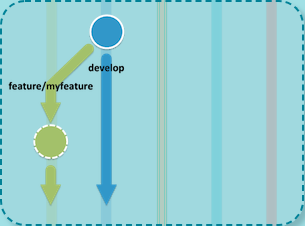
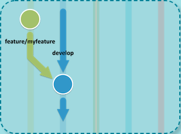
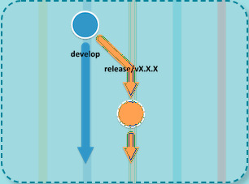
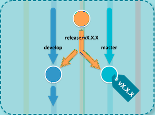
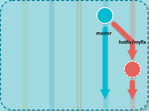

# Fluxo de versionamento com git flow

O git-flow é um conjunto de extensões para o git que provê operações de alto-nível para repositórios usando o modelo de branches do Vincent Driessen.


## 1. Instalação
O git flow funciona no macOS, Linux e no Windows

### 1.1. Linux
``` sh
$ apt-get install git-flow
```

### 1.2. Windows (Cygwin)
``` sh
$ wget -q -O - --no-check-certificate https://raw.github.com/petervanderdoes/gitflow-avh/develop/contrib/gitflow-installer.sh install stable | bash
```


## 2. Inicialização
O git-flow precisa ser inicializado para personalizar a configuração de seu projeto.

Comece o uso do git-flow fazendo sua inicialização dentro de um repositório git existente:


``` sh
$ git flow init -d
```


## 3. Fluxo

### 3.1. Funcionalidades

#### 3.1.1. Começar uma nova funcionalidade
O desenvolvimento de novas funcionalidades começa no branch 'develop'.



##### 3.1.1.1. Linux

Comece o desenvolvimento de uma nova funcionalidade com

``` sh
$ git flow feature start MYFEATURE
```

Esse comando cria um novo branch da funcionalidade baseado no 'develop' e alterna para ele

#### 3.1.2. Publicar uma funcionalidade
Você está desenvolvendo uma funcionalidade colaborativamente? 
Publique uma funcionalidade para o servidor remoto, assim ela pode ser utilizada por outros usuários.

##### 3.1.2.1. Linux

``` sh
$ git flow feature publish MYFEATURE
```

#### 3.1.3. Obter uma funcionalidade publicada
Obtenha uma funcionalidade publicada por outro usuário e acompanhe as alterações remotas.

##### 3.1.3.1. Linux
``` sh
$ git flow feature track MYFEATURE
```

#### 3.1.4. Finalizar uma funcionalidade
Finaliza o desenvolvimento de uma funcionalidade. Esse comando faz o seguinte



Mescla MYFEATURE no 'develop'
Remove o branch da funcionalidade
Volta para o branch 'develop'

##### 3.1.4.1. Linux

``` sh
$ git flow feature finish MYFEATURE
```

### 3.2. Versões
Auxilia a preparação de uma nova versão de produção
Permite correções de bugs menores e a preparação de metadados de uma versão

#### 3.2.1. Começar uma nova versão
Para começar uma versão, use o comando git flow release. Ele
cria um branch da versão baseado no branch 'develop'.



##### 3.2.1.1. Linux

``` sh
$ git flow release start RELEASE [BASE]
```

Você pode opcionalmente fornecer um hash sha-1 do commit [BASE] de onde começar a versão. O commit precisa estar no branch 'develop'

#### 3.2.2. Publicar uma versão
É sensato publicar o branch da versão depois de criá-lo, para permitir commits por outros desenvolvedores. É semelhante à publicação de uma funcionalidade com o comando:

##### 3.2.2.1. Linux

``` sh
$ git flow release publish RELEASE
```

#### 3.2.3. Obter uma versão publicada
Você pode acompanhar uma versão remota com o comando:

##### 3.2.3.1. Linux

``` sh
$ git flow release track RELEASE
```

#### 3.2.4. Finalizar uma versão
A finalização de uma versão é um dos grandes passos na ramificação/branching do git. Ele executa várias ações:



Mescla o branch da versão no 'master'
Etiqueta a versão com seu nome
Mescla o branch da versão de volta no 'develop'
Remove o branch da versão

##### 3.2.4.1. Linux

``` sh
$ git flow release finish RELEASE -m "ENTRE ESTAS ASPAS É NECESSÁRIO INSERIR UMA MSG PARA SER ASSOCIADA A TAG CRIADA"
```


### 3.3. Hotfixes
Os hotfixes surgem da necessidade de agir imediatamente sobre uma situação indesejada na versão de produção ativa.
Pode ser criado a partir da tag correspondente no branch master que indica a versão em produção.

#### 3.3.1. Começar um hotfix



##### 3.3.1.1 Linux

Assim como os outros comandos do git flow, um hotfix inicia com

``` sh
$ git flow hotfix start RELEASE
```
O argumento RELEASE nesse caso marca a versão defeituosa na produção


#### 3.3.2. Finalizar um hotfix


Ao finalizar um hotfix ele é mesclado tanto no develop quanto no master. Além disso, o merge no master é etiquetado.

##### 3.3.2.1. Linux

``` sh
$ git flow hotfix finish RELEASE -m "ENTRE ESTAS ASPAS É NECESSÁRIO INSERIR UMA MSG PARA SER ASSOCIADA A TAG CRIADA"
```
